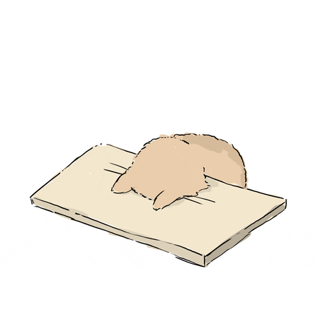
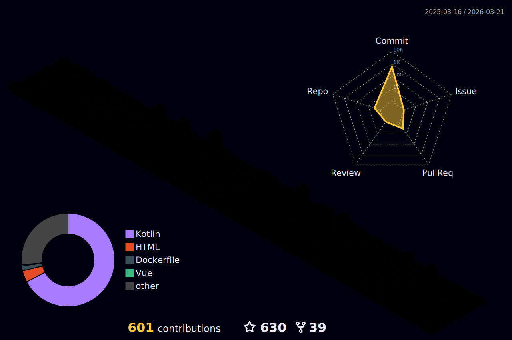

- 🧊 Minecraft Modpack-Maker
- 🌱 Raspberry Pi fan and tinkerer
- 🚢 Docker enthusiast and hobby container writer </img>
- 🕹️ Retro computer lover and hoarder
- ⌨ Coding noob and eternal learner
-   I enjoy working on
    -  ServerPackCreator
    -  Docker Containers
    - 🛠 DIY Raspberry Pi Projects
    -  Minecraft Modpacks 
    - 🚂 Occasional Java, VueJS & Quasar and Kotlin projects
- 📝 I write informational, funny and helpful blog-posts at times
- 🤔 I can be impatient with incomplete issue-reports
- 📙 Check out my [Blog](https://blog.griefed.de)
- 🎉 Fun-Fact: I love spaaaaaaaaaaaaaace and my wife

# 
🍵 Socials'n'Stuff ☕

  

    
    
    
    
    
    
    
    
  

  

### 
📃 Latest Blog Posts 📜
 

<!-- feed start -->

Mar 26 - <a href="https://blog.griefed.de/2023/03/26/virtualizing-windows-server-2022-and-accessing-it-via-rdp-through-a-vpn/">Virtualizing Windows Server 2022 and accessing it via RDP through a VPN</a>

Aug 29 - <a href="https://blog.griefed.de/2022/08/29/running-github-workflows-with-gitlab-ci-cd/">Running GitHub Workflows with GitLab CI/CD</a>

Jun 17 - <a href="https://blog.griefed.de/2022/06/17/blast-from-the-past/">Blast From The Past</a>

Apr 30 - <a href="https://blog.griefed.de/2022/04/30/qodana-and-gitlab/">Qodana, GitLab and Discord</a>

Oct 05 - <a href="https://blog.griefed.de/2021/10/05/let-them-trade-by-spaceflower-and-a-mapeditor/">Let Them Trade by Spaceflower – and a mapeditor!</a>

<!-- feed end -->

### 
🌟 Awesome People 🥳

<!-- sponsors --><!-- sponsors -->

  

# 
⚙ Technologies and Tools I am interested in and using ⚙

 

  

# 
🐙 Git Action 🦑

  

    
  

    
  
<!--
     -->
    
    
  

   
  

